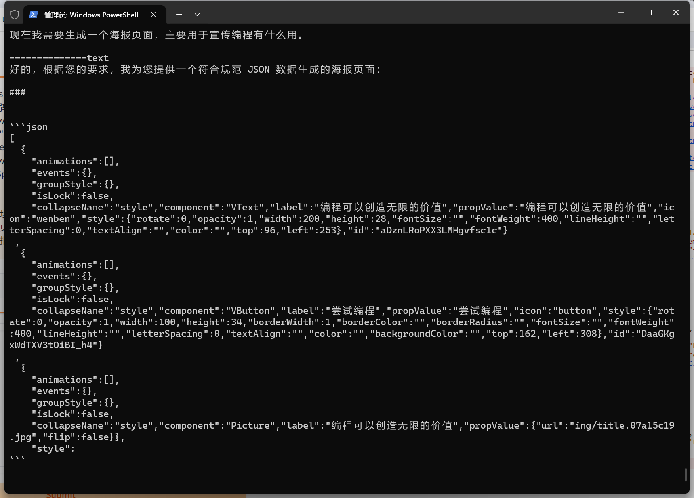
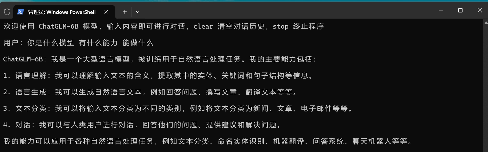
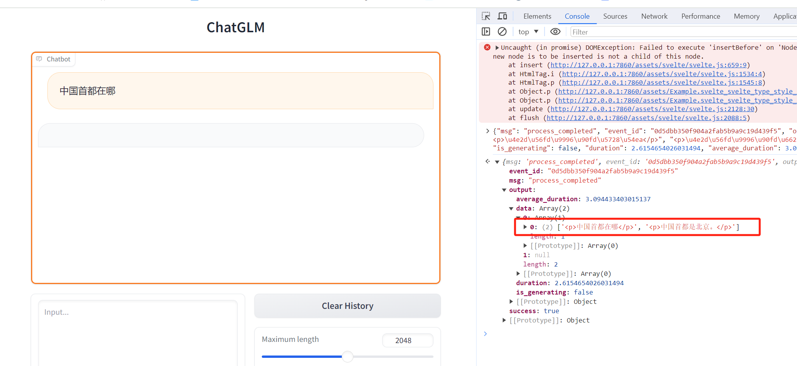

# lowcode-llm-demo

低代码平台与大语言模型的结合实践 demo

## 安装

请先查看这篇文章安装相关依赖 [手把手教你本地部署清华大学KEG的ChatGLM-6B模型——Windows+6GB显卡版本和CPU版本的本地部署](https://zhuanlan.zhihu.com/p/620455056)。本仓库的代码使用的是 Windows + CPU 版本。

模型文件太大，无法上传到 GitHub，需要自行下载。打开这个地址 <https://huggingface.co/THUDM/chatglm-6b-int4/tree/main> 找到模型文件 `pytorch_model.bin`，文件右边有一个向下箭头，点击下载。然后放到项目根目录下。

## 使用

通过命令行使用：

```sh
python ./cli-demo.py
```

通过浏览器使用：

```sh
python ./web-demo.py
```

浏览器网页不能正常显示响应内容，有 BUG，但是通过接口是可以看到返回内容的，没时间修复，先这样了。

**注意**：如果运行后没有任何反应，也没有报错，程序直接结束。说明系统资源不足，请关掉无关的程序后，再重新运行。

## DEMO 截图






