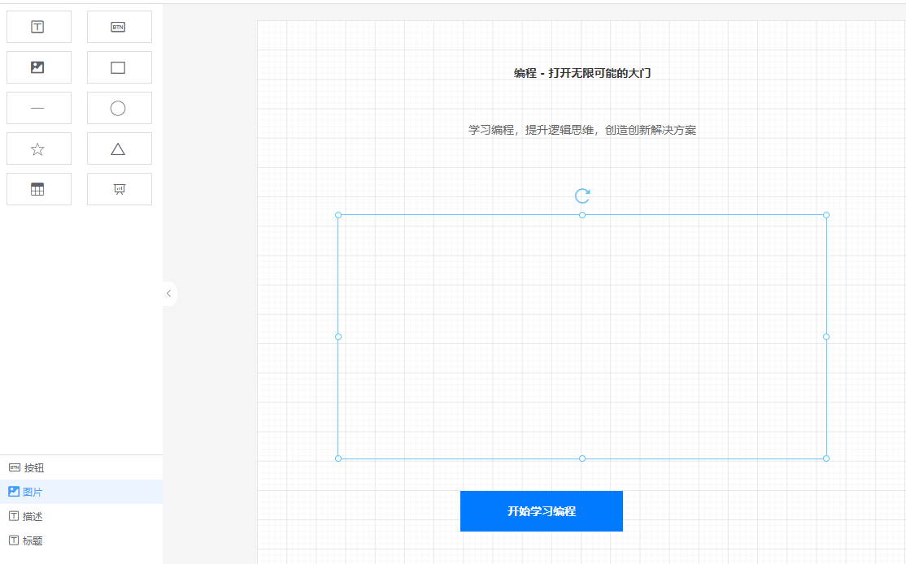
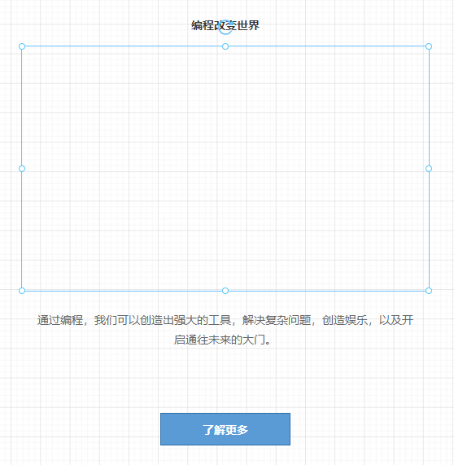
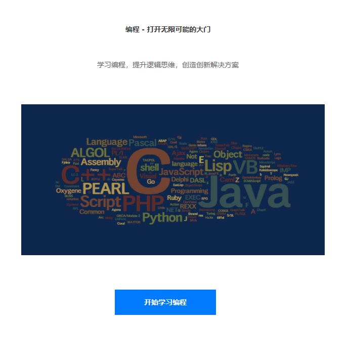

本分支使用的是 Azure Openai 部署的 chatgpt api 服务示例代码，如果想查看 chatglm-6b 示例代码，请查看 [main](https://github.com/woai3c/lowcode-llm-demo/tree/main) 分支。

## 安装

```sh
pnpm i
```

## 使用

将 `.env` 文件中的相关配置填写完整后，运行以下命令即可

```sh
node .\src\index.mjs
```

等待片刻即可看到 chatgpt 返回的低代码 JSON 数据。然后把这个 JSON 放到[低代码平台](https://woai3c.github.io/visual-drag-demo/)里导入使用，可以直接生成页面。

### 注意

1. 返回的数据是 JSON 字符串，所以需要自己手动转为 JSON 对象，把里面的一些特殊符号去掉，例如 `\n`。
2. chatgpt 返回的 JSON 字符串不一定每次都是正确的，有时候会返回错误的 JSON 字符串，所以需要自己手动检查一下。

## DEMO 截图






